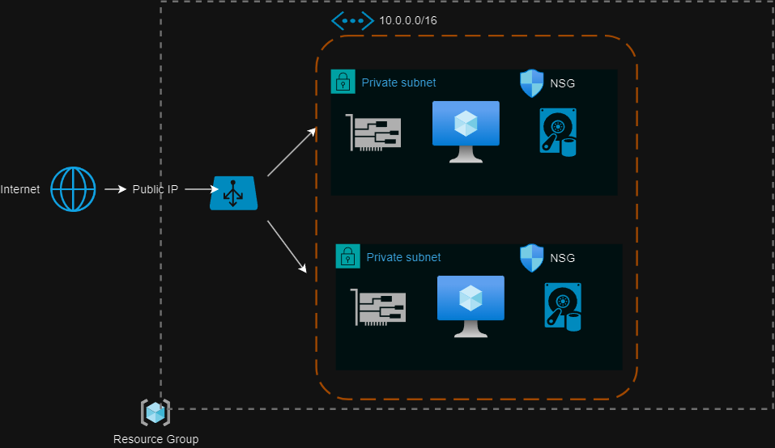
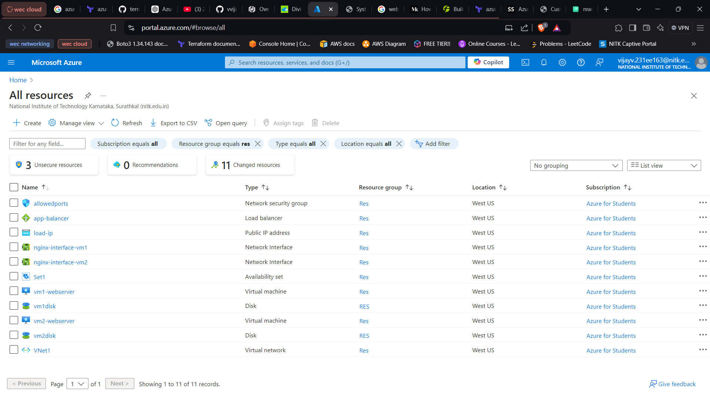
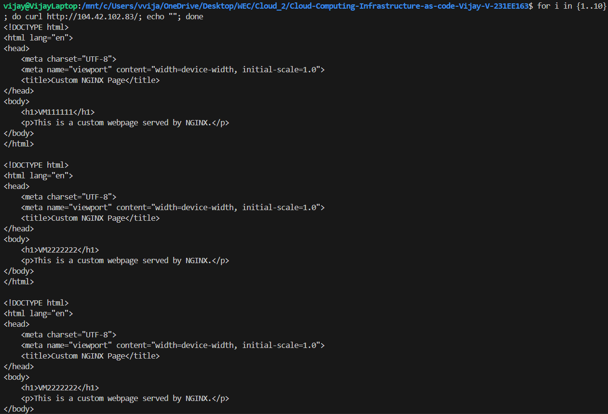
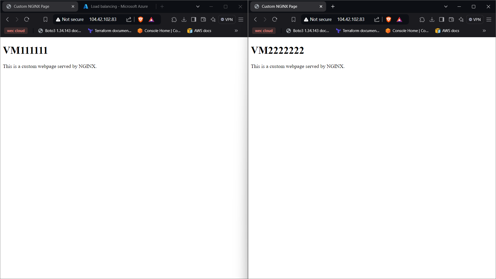

# Web Enthusiastic Club Recruitment Task

[](https://www.linkedin.com/in/vijay-v-0889a1280/)

## Introduction

Hello and welcome to my repository! 👋

This repo is part of my submission for the Web Enthusiast Club (WEC) recruitment task in **Cloud Computing and Infrastructure as Code (IaC)**. Below, you'll find details on how I approached and solved the task, including:

- A step-by-step explanation of the implementation.
- Documentation and resources I referred to during the task.
- Screenshots and a video demonstration showcasing the final working architecture.

Feel free to explore the repo and check out the documentation to get a complete understanding of the architecture and the deployment process. 😊
## 🚀 About Me

I am Vijay V (231EE163) 👋

I am passionate about **systems**, especially **cloud** and **networking**. I'm always eager to learn more from like-minded individuals and explore new technologies in these fields.
## Deployment

To deploy this project, follow these steps:

1. Navigate to the directory where your `.tf` (Terraform) files are located.

2. Run the following commands:

```bash
terraform init
terraform plan
terraform apply
```

- `terraform init`: This command initializes your working directory with the necessary plugins and providers specified in your configuration files. It downloads the required provider binaries.

- `terraform plan`: It creates an execution plan, showing what changes Terraform will apply to achieve the desired infrastructure state. This step allows you to verify the changes before applying them.

- `terraform apply`: This command executes the actions proposed in the `terraform plan`, creating or modifying resources in your infrastructure based on the `.tf` files.


## Environment Variables

To run this project, you will need to add the following variables to your variable.tf file.

```
variable "subscription_id" {
   description = "Azure subscription"
   default = "XXXXX-XXXXXXX-XXXXXXXX-XXXXXXX"
}


variable "tenant_id" {
   description = "Azure Tenant ID"
   default = "XXXXXX-XXXXXXX-XXXXXXX-XXXXXXX"
}

variable "instance_size" {
   type = string
   description = "Azure instance size"
   default = "Standard_F2"
}

variable "location" {
   type = string
   description = "Region"
   default = "West US"
}

variable "environment" {
   type = string
   description = "Environment"
   default = "dev"
}
```

## Architecture Overview

The architecture involves the following key components:
- **Resource Group**: Group for managing related resources.
- **Virtual Network (VNet)**: A virtual network where the VMs are hosted.
- **Availability Set**: Ensures high availability of the VMs by distributing them across different fault domains.
- **Load Balancer**: Distributes traffic between the two VMs for improved availability and fault tolerance.
- **Backend Pool**: Includes two VMs that will serve incoming traffic.
- **Health Probes**: Used by the Load Balancer to check the health of VMs.
- **Load Balancing Rules**: Define how traffic is distributed across the backend pool.

## Screenshots
### 1. Architecture of the system


### 2. Resources created in the Azure website


### 3. Load Balancer Traffic Distribution
when run the following command

```
for i in {1..10}; do curl http://<load-balancer-ip>; echo ""; done

```





## Lessons Learned

Throughout this project, I gained valuable experience in:

- Understanding the core components of cloud architecture, including virtual networks, load balancers, and virtual machines.
- Working with Terraform with azure to automate infrastructure deployment.
- Troubleshooting common issues related to networking and resource allocation in Azure.
- Enhancing skills in cloud infrastructure design, automation, and monitoring.

## Documentation

[Terraform](https://registry.terraform.io/providers/hashicorp/azurerm/latest/docs)

[Terraform_2](https://developer.hashicorp.com/terraform/language)

[public repo_1](https://github.com/hashicorp/terraform-provider-azurerm/tree/main/examples/virtual-machines/virtual_machine/2-vms-loadbalancer-lbrules)

[LB_1](https://www.youtube.com/watch?v=SpSJZmaGvFk&ab_channel=AlanRodrigues)

[LB_2](https://k21academy.com/microsoft-azure/architect/azure-load-balancer-step-by-step/)

[LB_3](https://terraformguru.com/terraform-real-world-on-azure-cloud/14-Azure-Standard-LoadBalancer-Basic/)

[Web_server_1](https://www.faizanbashir.me/building-an-nginx-webserver-on-azure-using-terraform)


